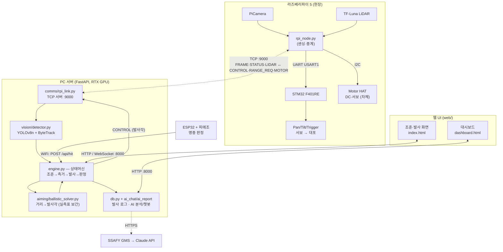
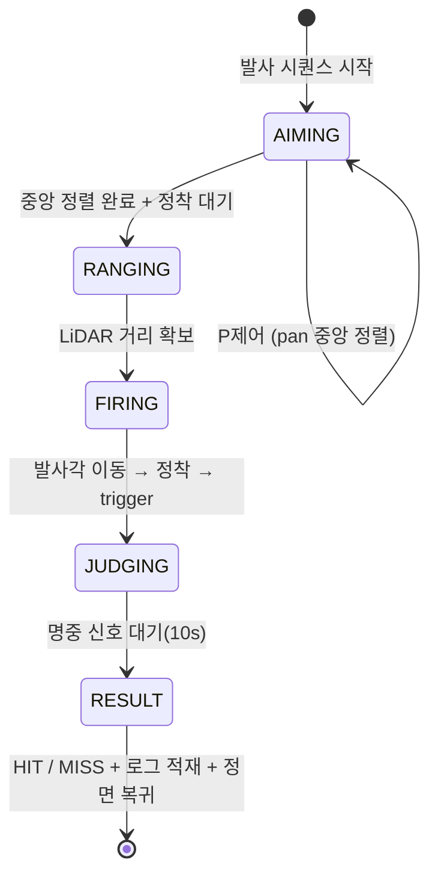

# AI 자동 조준·발사 시스템 — 시스템 문서

YOLO 객체 인식 + LiDAR 거리측정으로 표적을 자동 조준·발사하고 명중을 판정하는 시스템.
엣지(라즈베리파이=센싱·중계) ↔ 서버(PC GPU=YOLO 추론·조준)로 역할을 분리했다.

---

## 0. 성능 수치

| 지표 | 값 | 측정 조건 / 출처 |
|------|-----|------------------|
| **명중률** | **61 / 100 (61%)** @ 1~2m | 실측 데모. 거리 멀수록 하락 |
| 거리별 명중률 | 1~2m 최고, **>2m 급감** | 사거리 한계(~2.1m) + 먼 거리 좌우 오차 ↑ |
| **YOLO 추론 속도** | **~69 FPS** (14 ms/frame) | RTX 4050 Laptop, imgsz 1280 (벤치 측정) |
| 엔드투엔드 영상 | ~10~15 FPS | Pi 카메라/네트워크 전송이 병목 (Pi `--fps`) |
| **명중 판정 지연** | **~640 ms** | 발사 trigger → ESP32 명중신호 수신 (DB 측정) |
| 조준 완료 → 발사 | ~4~5 s | 조준정착 3s + 측거 + 발사정착 1s (`config`) |
| **LiDAR 거리 오차** | ±~6 cm | TF-Luna 스펙 (0.2~6m), 단위 cm |
| 착탄 오차 | 실측표 보정으로 흡수 | 거리·각도 캘리브레이션 의존 (피드백 누적) |

**해석**
- **명중률은 1~2m 구간이 가장 높고(61%), 2m를 넘으면 급격히 떨어진다.** 원인: ① 실측 사거리 한계 ~2.1m(정점 20°), ② 먼 거리일수록 같은 각도 오차가 큰 좌우 빗나감으로 증폭, ③ 서보 1° 분해능.
- **GPU 추론(69 FPS)은 충분히 빠르다.** 실제 체감 FPS는 Pi 카메라 캡처 + JPEG 전송이 병목이라 ~10~15 FPS.
- **거리 오차는 LiDAR 자체 ±6cm**가 바닥이고, 발사각의 착탄 오차는 실측 캘리브레이션 표 + 피드백 보정으로 줄인다.
- 먼 거리 정확도 개선: 조준 허용오차를 표적 박스 크기에 비례시켜(멀수록 엄격) 보정 — `app/aiming/controller.py`.

---

## 1. 시스템 구조도



**발사 시퀀스 (상태머신, `app/engine.py`)**



---

## 2. 통신 프로토콜

### 2.1 PC ↔ Raspberry Pi — TCP (포트 9000)

PC가 TCP 서버로 listen, Pi가 클라이언트로 접속. 메시지 프레이밍:

```
[1B type][4B length(big-endian uint32)][payload ...]
```

| type | MsgType | 방향 | payload | 포맷 |
|:----:|---------|------|---------|------|
| 1 | FRAME | Pi → PC | JPEG 카메라 프레임 | bytes |
| 2 | STATUS | Pi → PC | 현재 서보 각도 | `<ii` (pan, tilt) 8B |
| 3 | LIDAR | Pi → PC | 거리(mm) | `<i` 4B |
| 4 | CONTROL | PC → Pi | 목표 각도 + 발사 | `<iii` (pan, tilt, trigger) 12B |
| 5 | RANGE_REQ | PC → Pi | 측거 요청 | 없음 |
| 6 | MOTOR | PC → Pi | HAT 모터 명령 | JSON |

- **ControlPacket** `<iii`: `pan_target, tilt_target, trigger` (little-endian int32 × 3)
- **StatusPacket** `<ii`: `pan_current, tilt_current`
- **LIDAR** `<i`: `distance_mm`
- 정의: `app/comms/protocol.py` ↔ `pi/protocol.py` (동일 사본, **둘 다 수정 필요**)

### 2.2 Pi ↔ STM32 — UART (USART1, 115200 8N1)

`pi/stm32_link.py` ↔ `firmware/stm32_main.c`

```
Pi  → STM32 명령 (5B): [0xAA][pan(0-180)][tilt(0-180)][trigger(0/1)][checksum]
                        checksum = (pan + tilt + trigger) & 0xFF
STM32 → Pi 상태 (4B):  [0x55][pan_current][tilt_current][checksum]
                        checksum = (pan_current + tilt_current) & 0xFF
```

### 2.3 Pi ↔ LiDAR (TF-Luna) — UART via USB-CP2102 (115200 8N1)

`pi/lidar.py`. 9바이트 프레임(기본 cm 단위):

```
[0x59][0x59][Dist_L][Dist_H][Amp_L][Amp_H][Temp_L][Temp_H][Checksum]
  Dist = Dist_L + (Dist_H<<8)   (cm, 또는 mm 모드)
  Amp  : 신호강도. Amp<100 또는 ==65535 면 신뢰 불가
  Checksum = 앞 8바이트 합 & 0xFF
```
- **트리거 모드**: 평소 IR off, `RANGE_REQ` 시에만 1회 측정(noir 카메라 글레어 방지)

### 2.4 ESP32 ↔ PC — WiFi HTTP

명중 시 ESP32가 PC로 POST. `app/main.py` `/api/hit`, `firmware/esp32_hit/`

```
POST http://<PC_IP>:8000/api/hit
{ "source": "esp32", "ms": <millis>, "value": <피에조 피크값 0~4095> }
```

### 2.5 PC ↔ 웹 — HTTP / WebSocket (포트 8000)

- `GET /video_feed` — MJPEG 영상 스트림
- `GET /ws` — 상태 WebSocket (10Hz)
- `POST /api/engage` · `/api/select_at` · `/api/feedback` · `/api/home` · `/api/test_fire` 등
- `POST /api/ai_chat` · `/api/ai_report` — GMS(Claude) 분석/챗봇

---

## 3. 핀맵 (Nucleo-F401RE)

### UART (USART1) — Pi ↔ STM32
| STM32 | 방향 | Raspberry Pi |
|-------|:----:|--------------|
| **PA9** (TX, D8) | → | **GPIO15** (RXD, 핀 10) |
| **PA10** (RX, D2) | ← | **GPIO14** (TXD, 핀 8) |
| GND | — | GND (공통) |

> USART2(PA2/PA3)는 ST-Link VCP와 충돌하므로 **USART1 사용**.

### TIM3 PWM — 서보 3개 (50Hz, 펄스 0.5~2.5ms → 0~180°)
| 채널 | 핀 | 용도 | 비고 |
|------|----|------|------|
| TIM3_CH1 | **PA6** | Pan (좌우) | 시작 90° |
| TIM3_CH2 | **PA7** | Tilt (상하) | 시작 0° (수평), 가동 0~30° |
| TIM3_CH3 | **PB0** | Trigger (발사 걸쇠) | 평상 120° / 발사 0° / 500ms 후 자동 복귀 |

### 포트 / 주소
| 장치 | 값 |
|------|-----|
| Pi UART 포트 | `/dev/serial0` |
| LiDAR (CP2102) | `/dev/ttyUSB0` |
| Motor HAT (PCA9685) | I2C `0x6F`, DC 채널 2, 서보 채널 0, 60Hz |
| 서보 전원 | 외부 5~6V, **모든 GND 공통** |

---

## 4. 사용한 라이브러리 버전

### PC 서버 (Python 3.12, `.venv`)
| 패키지 | 버전 | 용도 |
|--------|------|------|
| torch | **2.6.0+cu124** | 딥러닝 (CUDA) |
| torchvision | 0.21.0+cu124 | — |
| ultralytics | **8.4.75** | YOLOv8 + ByteTrack |
| lap | ≥0.5.12 | ByteTrack 매칭 |
| opencv-python | 4.13.0.92 | 영상 처리 |
| numpy | 2.4.4 | — |
| fastapi | 0.138.0 | 웹 서버 |
| uvicorn[standard] | 0.49.0 | ASGI 서버 |
| websockets | 16.0 | 상태 WS |
| python-multipart | 0.0.32 | 폼/파일 |
| pydantic | ≥2.8.0 | — |
| anthropic | 0.111.0 | GMS(Claude) AI 분석/챗봇 |
| httpx | ≥0.27.0 | 테스트/목 클라이언트 |

> **PyTorch는 GPU에 맞춰 별도 인덱스로 먼저 설치**: RTX 40 → `cu124`, RTX 50(Blackwell) → `cu128`, CPU → `cpu`.
> 학습용(선택): `pybullet`(탄도 데이터 생성), `pandas`.

### Raspberry Pi 5 노드
| 패키지 | 설치 방식 | 비고 |
|--------|-----------|------|
| picamera2 | **apt** (`python3-picamera2`) | 카메라 |
| python3-opencv / python3-numpy | **apt** | ⚠️ pip 설치 금지(ABI 충돌→Bus error) |
| pyserial | pip ≥3.5 (또는 apt `python3-serial`) | UART |

> venv는 `--system-site-packages`로 만들어 시스템 패키지(picamera2/opencv/numpy)를 상속.

### 펌웨어
- STM32: STM32 HAL (CubeMX/CubeIDE), `firmware/stm32_main.c`
- ESP32: Arduino 프레임워크, `firmware/esp32_hit/esp32_hit.ino`

---

## 5. 환경 설정

### 5.1 PC 서버
```powershell
# 1) 가상환경
cd C:\Users\SSAFY\Desktop\server\server
python -m venv .venv

# 2) PyTorch (GPU에 맞는 빌드 먼저!)
.\.venv\Scripts\python -m pip install torch torchvision --index-url https://download.pytorch.org/whl/cu124

# 3) 나머지 의존성
.\.venv\Scripts\python -m pip install -r requirements.txt

# 4) AI 기능용 키 (선택)
$env:GMS_KEY="<발급키>"

# 5) 실행
.\run_server.ps1          # 또는 run_server.bat 더블클릭
#   = uvicorn app.main:app --host 0.0.0.0 --port 8000 --timeout-graceful-shutdown 2
```
- `DETECTOR=demo` 환경변수 → GPU/가중치 없이 색상 블롭 검출로 흐름 테스트
- 웹 UI: `http://localhost:8000/` , 대시보드: `/dashboard`

### 5.2 Raspberry Pi 5 노드
```bash
sudo apt install -y python3-picamera2 python3-opencv python3-numpy python3-serial
cd ~/pi
python3 -m venv --system-site-packages venv
source venv/bin/activate
pip install -r requirements.txt        # pyserial

# 실행
python3 rpi_node.py --pc-host <PC_IP> --stm32-port /dev/serial0 --lidar-port /dev/ttyUSB0
#   옵션: --no-stm32 / --no-lidar (단독 테스트), --width/--height/--fps/--jpeg-quality
```

### 5.3 네트워크 / 방화벽
- PC·Pi·ESP32 **같은 네트워크**(예: 모바일 핫스팟)
- PC 방화벽에서 **8000(웹·ESP32)·9000(Pi TCP)** 인바운드 허용
- PC IP가 바뀌면 Pi 실행 시 `--pc-host` 갱신

### 5.4 주의 (트러블슈팅)
| 증상 | 원인 / 해결 |
|------|------------|
| Pi `Bus error` | pip로 opencv/numpy 설치 → apt 패키지 + `--system-site-packages` 사용 |
| picamera2 색 반전 | 'RGB888'이 실제 BGR → `Camera.capture()`에서 색변환 안 함 |
| 카메라 I/O error | CSI 리본 접촉불량 → 재장착·재부팅·`rpicam-hello` |
| RTX 50(Blackwell) | torch는 **cu128** 빌드 필요 (cu124 미지원) |
| Ctrl+C로 서버 안 꺼짐 | `--timeout-graceful-shutdown 2` 사용 |

---

## 6. 주요 환경변수

| 변수 | 기본값 | 설명 |
|------|--------|------|
| `GMS_KEY` | (없음) | SSAFY GMS(Claude) 키 — AI 분석/챗봇 |
| `DETECTOR` | `yolo` | `demo`면 색상 블롭 검출(GPU 불필요) |
| `YOLO_DEVICE` | `0` | `0`=GPU, `cpu` 가능 |
| `SERVER_PORT` / `RPI_TCP_PORT` | 8000 / 9000 | 포트 |
| `PAN_AIM_OFFSET` | (config) | 발사 pan 고정 오프셋 |

전체 설정은 `app/config.py` 참조.
