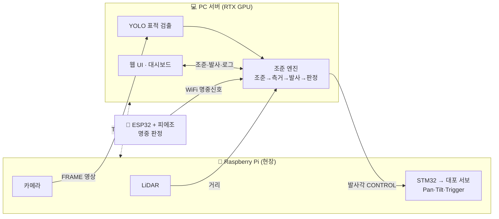

<div align="center">

# 🎯 AI 자동 조준·발사 시스템

**YOLO 객체 인식 + LiDAR 거리측정으로 표적을 자동 조준·발사하고 명중을 판정하는 시스템**

엣지(라즈베리파이) ↔ 서버(PC GPU) 분리형 · 실시간 웹 UI · AI 로그 분석


</div>

---

## 📖 개요

표적을 카메라로 인식(YOLO)하고 LiDAR로 거리를 재서 **자동으로 조준·발사**하며, 표적 뒤 피에조 센서로 명중을 판정한다. GPU가 없는 라즈베리파이는 **센싱·중계**만 맡고, PC가 **YOLO 추론·조준 계산**을 담당하는 엣지-서버 분리 구조다.

웹에서 표적을 클릭 → 자동 조준 → 측거 → 발사 → 명중 판정까지 한 번에 이뤄지며, 발사 로그는 대시보드에서 통계·AI 분석·**챗봇**으로 확인할 수 있다.

## ✨ 주요 기능

- 🎥 **실시간 표적 인식** — YOLOv8n + ByteTrack 트래킹 (웹 영상 클릭으로 표적 선택)
- 🎯 **자동 조준** — P 제어로 표적을 화면 중앙에 정렬 (거리 적응 정밀도)
- 📏 **거리 기반 발사각** — LiDAR 측거 → 실측 캘리브레이션 표 보간으로 tilt 결정
- 💥 **명중 판정·점수화** — ESP32 피에조 충격 세기를 0~100점(S~F)으로 환산
- 🔁 **착탄 피드백 보정** — 운영자 피드백으로 발사각 자동 누적 보정 (sim-to-real)
- 📊 **대시보드** — 명중률·거리별 통계·타임라인 + **GMS(Claude) AI 분석/챗봇**
- 🕹️ **수동 제어** — RC 조이스틱(차체)·대포 초기화·캘리브레이션 발사

## 🏗️ 시스템 구조



> 통신: PC↔Pi **TCP**, Pi↔STM32 **UART**, ESP32↔PC **WiFi**, 웹↔PC **HTTP/WS** · 자세한 구조도·프로토콜·핀맵은 **[📄 DOCS.md](DOCS.md)**

## 📊 성능

| 지표 | 값 |
|------|-----|
| 🎯 명중률 | **61 / 100 (1~2m)** · 멀수록 하락 |
| ⚡ YOLO 추론 | **~69 FPS** (RTX 4050, imgsz 1280) |
| 📏 LiDAR 거리 오차 | ±~6 cm · 실측 사거리 1.3~2.1m |
| ⏱️ 명중 판정 지연 | ~640 ms |

## 🛠️ 기술 스택

| 구분 | 기술 |
|------|------|
| **서버** | Python 3.12 · FastAPI · PyTorch (CUDA) · Ultralytics YOLOv8 · OpenCV |
| **엣지** | Raspberry Pi 5 · picamera2 · pyserial |
| **펌웨어** | STM32 F401RE (HAL) · ESP32 (Arduino) |
| **통신** | TCP · UART · WiFi(HTTP) · WebSocket |
| **AI 분석** | SSAFY GMS → Claude API |

## 🚀 빠른 시작

### PC 서버
```powershell
# 1) 가상환경 + PyTorch(GPU 빌드 먼저: RTX40→cu124 / RTX50→cu128 / CPU→cpu)
python -m venv .venv
.\.venv\Scripts\python -m pip install torch torchvision --index-url https://download.pytorch.org/whl/cu124
.\.venv\Scripts\python -m pip install -r requirements.txt

# 2) 실행 (또는 run_server.bat 더블클릭)
.\run_server.ps1
```
- 웹 UI: `http://localhost:8000/` · 대시보드: `/dashboard`
- GPU/가중치 없이 흐름만 테스트: `DETECTOR=demo`
- AI 분석/챗봇: 환경변수 `GMS_KEY` 설정

### Raspberry Pi 노드
```bash
sudo apt install -y python3-picamera2 python3-opencv python3-numpy python3-serial
cd ~/pi && python3 -m venv --system-site-packages venv && source venv/bin/activate
pip install -r requirements.txt
python3 rpi_node.py --pc-host <PC_IP> --stm32-port /dev/serial0 --lidar-port /dev/ttyUSB0
```

## 📁 프로젝트 구조

```
app/        PC 서버 (FastAPI) — main·engine·config·comms·vision·aiming·db·ai_chat
pi/         라즈베리파이 노드 — rpi_node·stm32_link·lidar·motor_hat
firmware/   STM32(서보 제어) · ESP32(명중 판정)
web/        웹 UI — index.html(조준) · dashboard.html(통계·AI)
train/      YOLO · 발사각 모델 학습
tools/      mock_rpi · 데이터 수집 · 캘리브레이션
data/       targets(데이터셋) · feedback(보정·로그)
models/     yolo/best.pt (배포 모델)
```

## 📚 문서

| 문서 | 내용 |
|------|------|
| **[DOCS.md](DOCS.md)** | 시스템 구조도 · 통신 프로토콜 · 핀맵 · 라이브러리 버전 · 환경설정 · 성능 |
| **[CLAUDE.md](CLAUDE.md)** | 개발자/AI 어시스턴트용 상세 명세 (모듈 맵 · config · 규약) |
| **[발표자료.pptx](발표자료.pptx)** | 프로젝트 발표자료 |

---

<div align="center">
SSAFY 15기 관통 프로젝트 · AI 자동 조준·발사 시스템
</div>
